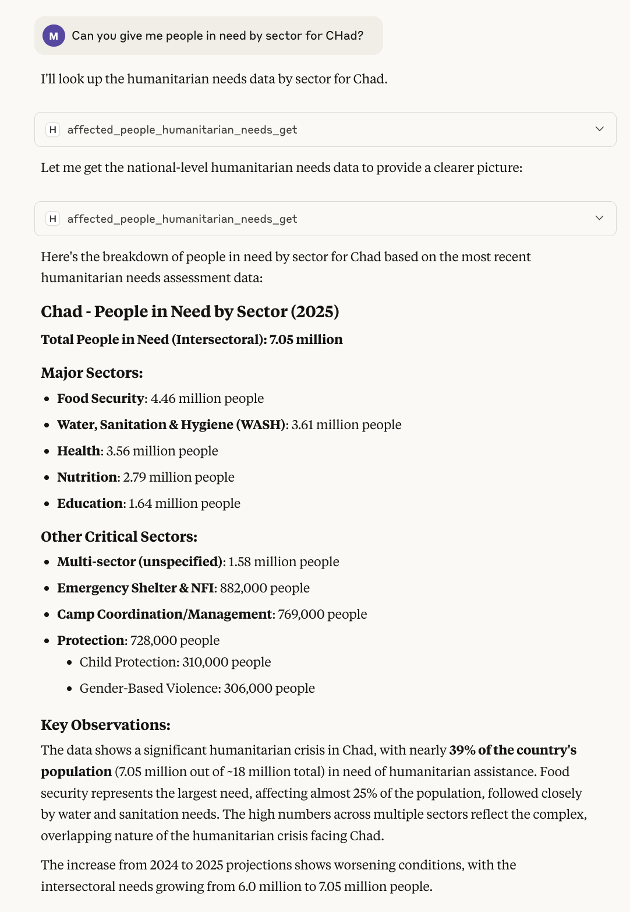

# Humanitarian Data Exchange (HDX) MCP Server

<div align="center">
  
  <br>
  <em>Example of using HDX MCP server used in Claude Desktop</em>
</div>

<br>

A Model Context Protocol (MCP) server that provides AI assistants access to the [Humanitarian Data Exchange (HDX) API](https://data.humdata.org/hapi). This provides a wide array of humanitarian data hosted on the [Humanitarian Data Exchange](https://data.humdata.org/).

This server can be installed in AI platforms such as Claude Desktop, as well as run as a remote MCP server for any AI to access.

## Available Tools

### 🔍 Metadata & Discovery (12 tools)
- `metadata_location_get` - Get countries/locations in HDX
- `metadata_admin1_get` - Get states/provinces
- `metadata_admin2_get` - Get districts/counties
- `metadata_data_availability_get` - **Check data coverage** (use first!)
- `metadata_dataset_get` - Get dataset information
- `metadata_resource_get` - Get resource details
- `metadata_org_get` - Get organizations
- `metadata_sector_get` - Get humanitarian sectors
- `metadata_currency_get` - Get currency info
- `metadata_org_type_get` - Get organization types
- `metadata_wfp_commodity_get` - Get WFP commodities
- `metadata_wfp_market_get` - Get WFP markets

### 🚨 Affected People (4 tools)
- `affected_people_refugees_get` - Get refugee/persons of concern data
- `affected_people_humanitarian_needs_get` - Get humanitarian needs data
- `affected_people_idps_get` - Get internally displaced persons data
- `affected_people_returnees_get` - Get returnee data

### 🌍 Demographics & Geography (1 tool)
- `geography_infrastructure_baseline_population_get` - Get population data

### 🌦️ Climate (1 tool)
- `climate_rainfall_get` - Get rainfall data

### 🤝 Coordination & Context (4 tools)
- `coordination_context_operational_presence_get` - Get operational presence
- `coordination_context_funding_get` - Get funding data
- `coordination_context_conflict_events_get` - Get conflict events
- `coordination_context_national_risk_get` - Get national risk data

### 🍽️ Food Security & Poverty (3 tools)
- `food_security_nutrition_poverty_food_security_get` - Get food security data
- `food_security_nutrition_poverty_food_prices_get` - Get food prices
- `food_security_nutrition_poverty_poverty_rate_get` - Get poverty rates

### 🔧 Utilities (1 tool)
- `util_version_get` - Get API version

### 🎯 Custom HDX Tools (3 tools)
- `hdx_server_info` - Get server information
- `hdx_get_dataset_info` - Get detailed dataset info
- `hdx_search_locations` - Search for locations

### Caveats

The HDX API offers a very rich source of Humanitarian data, but it is complex. The coverage of data by regions differs per country, as showing in the table [here](https://data.humdata.org/hapi). This is not a technical limitation, but due to the challenging work of humanitarian organizations gathering data. This does however introduce some limitations, for example, conflict events in Afghanistan are only available at the province and district level, not national. Therefore questions about total count at the country level should not be supported as this would require gathering large volumes of disaggregated data and summation to the national level, both prohibitive and error-prone.

The MCP server provided prompts for helping LLMs identify and inform the user, but as with any LLM application, evaluation testing and ongoing monitoring is required.

## Quick Start

Get a free HDX API 'Application identifier' code ...

1. Go to the [api page](https://hapi.humdata.org/docs#/Generate%20App%20Identifier/get_encoded_identifier_api_v2_encode_app_identifier_get)
2. On the 'encode_app_identifier' endpoint, click 'Try it out'
3. Enter an application name for your process and your email
4. Click 'Execute'
5. Make note of the displayed application identifier code

Then install using Docker MCP Hub and MCP Toolkit (recommended) ...

1. Install [Docker Desktop](https://docs.docker.com/desktop/) 4.43 or above and start
2. Activate 'MCP Tools' under Settings > Beta Features
3. Under 'MCP Tools' search for 'HDX' and add the server
4. When prompted input your app identifier from above

You can now use with various clients such as Claude Desktop (see 'Clients' section in Docker).

### Other ways to use the HDX MCP Server

1. Install UV (if not already installed): `curl -LsSf https://astral.sh/uv/install.sh | sh`
2. Clone this repo: `git clone https://github.com/dividor/hdx-mcp.git`
3. `cd hdx-mcp`
4. `uv sync --all-extras --dev`
5. `cp env.example .env`
6. Then Edit your `.env` and set `HDX_APP_IDENTIFIER` to the application identifier you created above
7. Run the server: `uv run hdx-mcp-server --transport http --host 0.0.0.0 --port 8000 --verbose`

You can use MCP Inspector to test the server ...

1. [Install MCP Inspector](https://modelcontextprotocol.io/legacy/tools/inspector)
2. Set Transport type (top-left) to be: Streamable HTTP
3. Enter URL: `http://127.0.0.1:8000/mcp`
4. Click Connect
5. Click on Tools or Prompts, and use the get and submit buttons to try out the server

### Option 2: Using Docker (Recommended for Claude Desktop)

```bash
# Build the Docker image
docker build -t hdx-mcp-server .

# Run with stdio transport (for MCP clients)
docker run --rm -i --env-file .env hdx-mcp-server

# Run with HTTP transport
docker run --rm -p 8000:8000 --env-file .env hdx-mcp-server --transport http --host 0.0.0.0

```

## Using the HDX MCP Server in Claude Desktop

1. **Complete the basic setup above** - ensure the server works with `uv run hdx-mcp-server`

2. **Get the absolute path to your project:**
   ```bash
   cd /path/to/your/hdx-mcp
   pwd  # Copy this path
   ```

3. **Configure Claude Desktop:**

   Open Claude Desktop settings and add to your MCP servers configuration:

   **Option A: Using Docker (Recommended)**
   ```json
   {
     "hdx-humanitarian-data": {
       "command": "docker",
       "args": ["run", "--rm", "-i", "--env-file", "/absolute/path/to/your/hdx-mcp2/.env", "hdx-mcp-server"]
     }
   }
   ```

   **Option B: Using UV**
   ```json
   {
     "hdx-humanitarian-data": {
       "command": "uv",
       "args": ["run", "hdx-mcp-server"],
       "cwd": "/absolute/path/to/your/hdx-mcp"
     }
   }
   ```

   **Replace `/absolute/path/to/your/hdx-mcp` with the actual path from step 2.**

4. **Ensure your `.env` file is configured** with your HDX app identifier:
   ```bash
   HDX_APP_IDENTIFIER=your_hdx_app_identifier_here
   HDX_BASE_URL=https://hapi.humdata.org
   ```

5. **Restart Claude Desktop** to load the new MCP server

### Verification

Once configured, you should see the HDX server appear in Claude's MCP servers list. You can test it by asking Claude to:

- "List available HDX tools"
- "What is the population of Chad?"
- "Give me a summary of refugee status in Syria"

## Configuration

### Environment Variables

The server is configured via environment variables. Copy `env.example` to `.env` and customize:

| Variable | Required | Default | Description |
|----------|----------|---------|-------------|
| `HDX_APP_IDENTIFIER` | **Yes** | - | Your HDX application identifier |
| `HDX_BASE_URL` | No | `https://hapi.humdata.org/api/v2` | HDX API base URL |
| `HDX_OPENAPI_URL` | No | `https://hapi.humdata.org/openapi.json` | OpenAPI spec URL |
| `HDX_TIMEOUT` | No | `30.0` | HTTP request timeout (seconds) |
| `HDX_APP_NAME` | No | `hdx-mcp-server` | Application name for HDX |
| `HDX_APP_EMAIL` | No | `assistant@example.com` | Contact email for user of HDX API |
| `MCP_HOST` | No | `localhost` | Host for HTTP transport |
| `MCP_PORT` | No | `8000` | Port for HTTP transport |

### Complete Configuration Example

See `env.example` for a complete configuration template with detailed comments:

```bash
# View the configuration template
cat env.example

# Copy and edit for your environment
cp env.example .env
nano .env
```

### Excluded Endpoints

The server automatically excludes the following endpoints:
- `/api/v2/encode_app_identifier` - Internal utility for generating app identifiers

## Security Considerations

This server follows MCP security best practices:

### Authentication & Authorization
- ✅ API keys stored in environment variables, never hardcoded
- ✅ API keys not logged or exposed in error messages
- ✅ Proper HTTP client configuration with timeouts
- ✅ Base64 encoding for app identifiers as required by HDX

### Input Validation
- ✅ FastMCP handles input schema validation automatically
- ✅ Custom tools include proper type hints and validation
- ✅ Error handling prevents information leakage

### Network Security
- ✅ HTTPS-only communication with HDX API
- ✅ Configurable timeouts to prevent hanging connections
- ✅ Proper error handling for network failures

### Data Handling
- ✅ No persistent data storage
- ✅ Proper cleanup of HTTP connections
- ✅ Graceful shutdown handling

## Troubleshooting

### Common Issues

1. **"Required environment variable HDX_APP_IDENTIFIER is not set"**
   - Ensure you have copied `.env.example` to `.env`
   - Verify your HDX application identifier is correctly set in `.env`

2. **"Failed to load OpenAPI specification"**
   - Check your internet connection
   - Verify HDX API is accessible: `curl https://hapi.humdata.org/openapi.json`

3. **HTTP transport not accessible.**
   - Check if the port is already in use
   - Verify firewall settings if accessing remotely
   - Use `--host 0.0.0.0` for external access

4. **Authentication errors**
   - Verify your HDX API app identifier is valid
   - Check if your account has necessary permissions

### Logging

Enable verbose logging for debugging:
```bash
uv run hdx-mcp-server --verbose
```

This will show detailed information about:
- Server initialization
- OpenAPI spec loading
- Tool registration
- HTTP requests and responses
- Error details

## Contributing

See [CONTRIBUTING.md](CONTRIBUTING.md) for detailed development guidelines, testing instructions, and contribution workflow.

## License

This project is licensed under the MIT License - see the LICENSE file for details.

## Related Resources

- [HDX (Humanitarian Data Exchange)](https://data.humdata.org/)
- [HDX HAPI Documentation](https://hdx-hapi.readthedocs.io/)
- [Model Context Protocol Specification](https://modelcontextprotocol.io/)
- [FastMCP Documentation](https://gofastmcp.com/)

## Support

For issues related to:
- **This MCP server**: Open an [issue](https://github.com/dividor/hdx-mcp/issues) in this repository
- **HDX API**: Consult [HDX HAPI documentation](https://hdx-hapi.readthedocs.io/)
- **MCP protocol**: See [MCP specification](https://modelcontextprotocol.io/)
- **FastMCP library**: Check [FastMCP documentation](https://gofastmcp.com/)

## Issues & Feedback

- **Issues & Suggestions**: Please raise an [issue](https://github.com/dividor/hdx-mcp/issues) for any bugs, feature requests, or suggestions
- **Security Issues**: For security-related concerns, please raise an issue to be contacted privately

---

**Note**: This server requires a valid HDX API app identifier. Please ensure you comply with HDX's terms of service and rate limiting guidelines when using this server.
